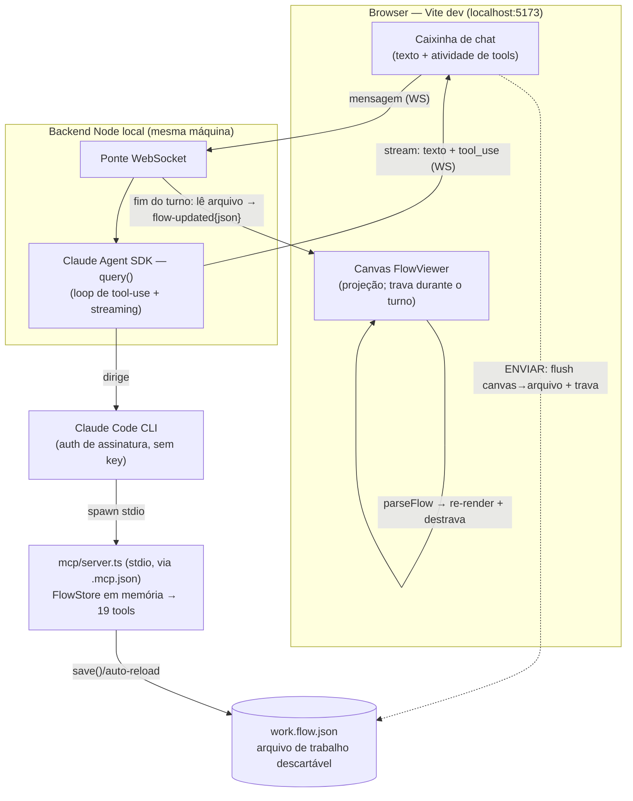

# PLANS.md — FlowViewer: de visualizador a editor de fluxos OmniChat

<!-- HANDOFF:START -->
## 🔄 Handoff — 2026-06-25 (passo 3 VERIFICADO ponta-a-ponta — `/verify` PASS)

**Foco da próxima sessão:** **passo 4 do build** — Integrar a caixinha de chat no FlowViewer React:
componente `ChatPanel`, lock do canvas durante o turno, flush canvas→arquivo no ENVIAR (reusa export),
`flow-updated`→`parseFlow` com guard de parse, snapshot por turno + "desfazer último turno".
Plano em PLANS § "Caixinha de chat na página — PoC local do agente construtor" (decisões 4, 5, 7).
**Primeiro item concreto do passo 4: incluir o `flowJson` COMPLETO no evento `flow-updated`** — ver
"Fios soltos" abaixo; é pré-requisito do re-render do canvas React.

**Onde paramos:** branch **`docs/chat-poc-plan`**, **árvore limpa**. Passo 3 **commitado** (`64320c0`)
— [backend/server.ts](backend/server.ts) (HTTP + WebSocket, Agent SDK com `resume` por `session_id`,
streama `text`/`tool`/`flow-updated`/`done`/`error`) e [backend/index.html](backend/index.html) (UI dark
mínima). Nesta sessão **rodei `/verify` com prompt real** (`npm run ws:dev` → porta 4000) e deu **PASS**:
o Agent SDK com auth de assinatura (sem key) dirigiu o MCP stdio, streamou tools (`create_node`,
`list_nodes`…), o arquivo de trabalho mudou no disco (42→43 nós, nó `Teste` persistido), o **lock**
("Turno em andamento") segurou a 2ª mensagem, e o **`resume`** disparou no 2º turno (log
`turno iniciado (resume …)`). O **maior risco do PoC está derriscado.**

**Fios soltos / meio-feito:**
- ⚠️ **`flow-updated` manda só `{ nodeCount }`, NÃO o JSON inteiro** — [server.ts:112-114](backend/server.ts#L112-L114).
  A decisão 3 do plano exige o JSON completo embutido para a UI fazer `parseFlow`. OK para a UI HTML
  mínima do passo 3, mas o **passo 4 (canvas React) precisa do `flowJson` completo no evento** — é o
  primeiro item a implementar.
- ⚠️ **Agente não consegue setar o texto de um `defaultNode`** ("sem campos configuráveis" via MCP) —
  "crie um nó de mensagem com texto X" tem sucesso pela metade (cria o nó, não grava o texto). Não é
  bug do passo 3, é gap da superfície de tools do MCP; casa com a dívida de sub-enums adiada na Fase 2.
- [scripts/smoke-chat-poc.mjs](scripts/smoke-chat-poc.mjs) — já está **tracked** (dúvida "commitar ou
  apagar" resolvida). Fio fechado.
- Limpeza de branches órfãs — pendente, não bloqueia.

**Armadilhas desta sessão (não estão no PLANS ainda):**
1. `sdk.d.ts` do Agent SDK tem erros de tipos internos — usar `--skipLibCheck` em qualquer
   `tsc` que cubra o `backend/`. O `mcp:typecheck` (tsconfig do MCP) não cobre `backend/`.
2. `resume` no SDK exige o `session_id` do evento `system/init` (campo `msg.session_id`). O servidor
   guarda por conexão WS e passa como `{ resume: sessionId }` no próximo `query()`. Mesmo ao resumir,
   repassar `mcpServers` e `settingSources: []` pois o subprocesso é novo. **Verificado funcionando.**
3. `ws` é devDep (`npm install --save-dev ws @types/ws`). Cliente de teste fora da árvore do projeto
   não resolve `ws` por bare specifier — usar `createRequire('d:/Fluxo/package.json')`.
4. Servidor de teste deve subir com `run_in_background` do Bash (o `&` do Git Bash não sobrevive
   entre chamadas de tool). Porta isolada (ex.: 4042) evita colisão.

**Armadilhas herdadas ainda válidas:**
5. `query()` exige `settingSources: []` para não carregar `.mcp.json` e subir 2º MCP.
6. Smoke rodou aninhado no Claude Code — auth funcionou mesmo assim; prova 100% fiel = terminal limpo
   fora do CC (incremental, não bloqueia).
7. `save()` normaliza CRLF→LF (invariante do `serializeFlow`).

**Próximo passo imediato:** No passo 4, começar editando [server.ts:111-115](backend/server.ts#L111-L115)
para mandar o `flowJson` completo (não só `nodeCount`) no `flow-updated`; depois o componente React
`ChatPanel` consome o evento → `parseFlow` com guard → re-render + destrava o canvas.

**Ponteiros:** plano em PLANS § "Caixinha de chat" (decisões 4=UX; 5=lock/flush; 6=reloadFromFile;
7=snapshot+guard; 8=WS+resume); [backend/server.ts](backend/server.ts);
[backend/index.html](backend/index.html); commit passo 3: `64320c0`; passo 2: `18bf0e7`.

**Skills sugeridas ao retomar:** `/code-review` antes de commitar o passo 4; `/verify` com a UI React
integrada (manda mensagem → canvas re-renderiza com o nó novo + destrava).

<!-- HANDOFF:END -->

## Contexto

O FlowViewer hoje é um **visualizador read-only**: importa o JSON de intenções de um bot
OmniChat, parseia em `src/utils/parseFlow.ts` e renderiza com `@xyflow/react` (React
Flow 12) + layout automático via Dagre. A plataforma OmniChat **não tem editor visual
nem importador/exportador de arquivo** — só uma tela Angular que edita intenção por
intenção.

Objetivo do projeto: evoluir o FlowViewer para um **editor visual** (criar nós, conectar,
editar conteúdo) capaz de gerar JSON válido e, opcionalmente, enviar direto para a
plataforma via API.

## Contrato de API descoberto (engenharia reversa do bundle + captura de rede)

Base: `https://k0yowczqxg.execute-api.us-east-1.amazonaws.com/prod`
(API Gateway AWS; o front em `app.omni.chat` chama cross-origin).

| Operação | Chamada |
|---|---|
| Listar intenções | `GET /v1/{botId}/intents?fullObject=true` → `{ "list": [intent, ...] }` |
| Salvar/criar intenção | `POST /v1/{botId}/intents/{intentId}` (body = objeto intent completo) |
| Excluir intenção | `DELETE /v1/{botId}/intents/{intentId}` |
| Mesmas rotas para | `endpoints` e `entities` (coleções irmãs de intents) |
| Bot inteiro | `POST /v1/bots` (salvar), `POST /v1/bots/duplicate`, `POST /v1/{botId}/publish`, `GET /v1/{botId}/versions/{id}` |

Headers de autenticação necessários (capturados de uma sessão real):
`authorization: Bearer <token>`, `x-parse-session-token: <token>`,
`x-parse-application-id: <app id fixo>`, `x-omnichat-platform: web`.
O token é o de sessão do usuário logado (Parse Server). **Nunca commitar tokens.**

### Fatos de schema confirmados (POST capturado vs samples de GET)

- O body do POST tem **a mesma forma** dos itens do GET — round-trip é viável.
- `id` das intenções: UUID v4. A intenção inicial usa ID especial `{botId}-start`.
- `condition.next.intent` = **objeto** `{ botId, id }`.
- `action.error.next.intent` = **string** (ID), com `intentBot` como campo irmão.
  Essa assimetria existe em GET e POST igualmente — preservar na serialização.
- Campo `advanced: { active, endpointId }` existe nos exports mais novos
  (sample02/03) e no POST; ausente no sample01 (mais antigo). Tratar como opcional,
  mas sempre emitir no POST.
- O formulário Angular envia o `action` com **todos os campos presentes**
  (nulls/defaults explícitos: `captureDataTypesCategory`, `multipleFields`,
  `lastMessageTextParams`, etc.), enquanto GETs antigos omitem alguns. Serializar
  sempre a forma completa canônica (a do POST capturado).
- Ações que referenciam `endpoints`/`entities` apontam para IDs já existentes no
  bot — o editor trata como referência, nunca cria.

Payload de referência: ver captura do POST de `aguarda_atendente` (transfer) feita
em 2026-06-11 — manter cópia **sanitizada** (sem headers) se necessário em
`samples/`.

## Arquitetura alvo

**Inverter a fonte de verdade.** Hoje: JSON → parseFlow (lossy) → nós React Flow.
Alvo: o modelo `BotIntent[]` é a fonte de verdade; o canvas é uma projeção editável.

- Cada nó guarda seu `BotIntent` cru em `node.data` (campo `raw`).
- Edição estrutural no canvas (conectar/desconectar) = patch no intent
  (`condition.next`).
- Edição de conteúdo no DetailPanel = patch nas `conditions`/`assistant_says`.
- Exportar = remontar `{ list: [...] }` a partir dos intents (originais + patches).
  Nunca reconstruir campos não editados — **preservar e aplicar patch**, não
  serializar do zero.

## Agente de IA que constrói nós (Claude Code CLI + servidor MCP local)

> Promovido do handoff em 2026-06-23 após interrogatório (skill `interrogar`). Esta é a
> **feature-foco** das próximas sessões; o handoff no topo aponta pra cá. O masterFlow
> (parado/completo na Parte 12) deixa de ser o foco.

**Objetivo (1 frase):** um agente de IA que **constrói e edita nós do fluxo operando
ferramentas** (nunca escrevendo JSON cru), via **Claude Code CLI + um servidor MCP local**
sobre o arquivo de fluxo, estruturado desde já para virar produto depois.

**Decisões-âncora (travadas no design original — NÃO reabrir):**
- O agente **opera tools, nunca escreve JSON cru**. As tools envolvem as funções que já
  existem; a validade fica no código, não na memória do modelo.
- O **servidor MCP é a peça durável** — o mesmo conjunto de tools é reusado no
  caminho-produto; só troca o cliente.
- **Local:** Claude Code lança o MCP como **subprocesso por stdio** — zero portas, zero
  rede de entrada. Único tráfego é **de saída** (API Anthropic + API OmniChat). O gh-pages
  **NÃO** fala com o MCP — site e agente são ilhas que só se cruzam pelo **arquivo de fluxo
  em disco** (a UI lê o arquivo só sob demanda via "Carregar exemplo"/import — ela NÃO o lê
  ao vivo; ver [ImportDialog.tsx:27](src/components/ImportDialog.tsx#L27)).
- **Token** vive na **camada de tools** (`OMNI_TOKEN` de `flow-viewer.env`), nunca chega ao
  modelo, nunca é logado. **Resolver por nome → gravar por ID** (o ID sempre vem de resposta
  real da API ⇒ mata referência alucinada).
- **Modelo:** default `claude-sonnet-4-6`; subir p/ `claude-opus-4-8` se errar a sequência
  em pedidos compostos.

**Ordem revista (interrogatório 2026-06-23, Q1 — spike-primeiro).** O refactor do catálogo
(antiga Fase A) foi **adiado para depois do spike**: provar o conceito contra fluxos reais
antes do refactor caro que toca o [DetailPanel.tsx](src/components/DetailPanel.tsx) (~3500
linhas, 383 testes — o arquivo mais arriscado). De-risca e respeita "amostra mínima antes de
escalar". Nova ordem: **1 spike → 2 catálogo → 3 MCP → 4 resolvers → 5 produto.**

> **Fases 1, 2, 3, 4 e 4b ✅ concluídas e mergeadas na `main`** (spike: merge `15cbf54`;
> Fase 2: merge `e701026`; ambos 2026-06-24). Detalhes do spike (Fases 1/3/4/4b) em
> [docs/PLANS-ARCHIVE.md](docs/PLANS-ARCHIVE.md). Segue viva abaixo apenas a **Fase 5**
> (produto, direcional); a **Fase 2** permanece logo abaixo como **registro de decisões
> concluídas** (não migrada ao archive: PLANS abaixo do limiar de ~600 linhas).

### Fase 2 — Centralizar `NODE_CATALOG` (refactor/limpeza) ✅ CONCLUÍDA (mergeada)

> **Resultado (2026-06-24, merge `e701026`, branch `feat/node-catalog`):** entregue em
> [src/utils/nodeCatalog.ts](src/utils/nodeCatalog.ts) — `NODE_CATALOG` (11 `CreatableKind`)
> como fonte única kind-level (`label`/`actionType`/`creatable`/`hasError`/`summary`/`fields`).
> `nodeMeta.ts` (`actionToNodeKind`), `intentTemplates.ts` (`CREATABLE_KINDS`/`*_LABELS`/
> `ACTION_KINDS_WITH_ERROR`), [mcp/nodeManifest.ts](mcp/nodeManifest.ts) (rename de
> `mcp/nodeCatalog.ts`, agora formatador fino) e [DetailPanel.tsx](src/components/DetailPanel.tsx)
> **derivam** do catálogo. Os 4 commits do plano abaixo executados na ordem
> (`ab2b0e5`→`5788e28`→`b290d00`→`086dffb`); teste golden em
> [src/utils/nodeCatalog.test.ts](src/utils/nodeCatalog.test.ts) trava label/actionType/hasError.
> **Suíte cheia verde (453 testes), `mcp:typecheck` limpo** (revalidado 2026-06-25). Sem mudança
> de comportamento. As decisões abaixo ficam como registro do **porquê** do código atual.

**Objetivo (entregue):** um único `src/utils/nodeCatalog.ts` (Node-pure) como fonte de
verdade *por tipo de nó*, do qual derivam as constantes antes duplicadas em ≥4 arquivos, e do
qual o manifesto MCP passou a **derivar** em vez de duplicar à mão.

> Plano fechado por interrogatório (skill `interrogar`) em 2026-06-24. As decisões abaixo
> estão TRAVADAS — registro do raciocínio; não reabrir sem novo interrogatório.

**Verdade espalhada hoje (o alvo):** `NodeKind` [types.ts:130](src/types.ts#L130);
`actionToNodeKind`/`CONDITION_TYPE_LABELS`/`PRIORITY_LABELS` [nodeMeta.ts](src/utils/nodeMeta.ts);
`CREATABLE_KINDS`/`CREATABLE_KIND_LABELS`/`ACTION_TYPE_BY_KIND`(privado)/`ACTION_KINDS_WITH_ERROR`/`buildKindAction`
[intentTemplates.ts](src/utils/intentTemplates.ts); consts inline por tipo no
[DetailPanel.tsx](src/components/DetailPanel.tsx) (`KIND_LABELS_LIGHT/DARK`, `KIND_OPTIONS`,
`STORE_ACTIONS`, `ORDER_ACTIONS`, `EXTERNAL_TYPES`, `TRANSFER_*`); manifesto hand-written
[mcp/nodeCatalog.ts](mcp/nodeCatalog.ts).

**Decisões (com o porquê):**
1. **Catálogo MAGRO, kind-level (Opção A).** Absorve só fatos *por tipo de nó*: `label`,
   `actionType`, `creatable`, `hasError`, `summary`, `fields`. Os sub-enums internos
   (`TRANSFER_*`, `STORE_ACTIONS`, `CAPTURE_FIELDS`, …) **NÃO** entram — já são fontes únicas
   locais bem-comportadas, com um só consumidor. O valor que paga tocar o arquivo de 383
   testes é (a) o MCP **derivar** o manifesto (hoje hand-written → diverge silenciosamente) e
   (b) matar a duplicação do enum-de-tipos+label (repetido em 3 lugares). Catálogo gordo seria
   consolidar o que não está espalhado.
2. **`src/utils/nodeCatalog.ts`, Node-pure; cor/ícones FORA.** O `mcp/` importa o catálogo e
   roda em Node sem DOM ⇒ catálogo = só domínio. `color` (Tailwind, light/dark) é tema → fica
   num mapa de tema à parte chaveado por `NodeKind` (regra de ouro do dark-mode: tema separado
   da estrutura). `label` é domínio e compartilhável; `color` não.
3. **Rename `mcp/nodeCatalog.ts` → `mcp/nodeManifest.ts`** para não colidir com o novo
   `src/utils/nodeCatalog.ts`. O de mcp vira derivador fino + formatador (`manifest`/`describeNodeType`).
4. **Catálogo chaveado pelos 11 `CreatableKind` (uniforme, sem union).** Descoberta no início
   do commit 1: existem **dois sistemas de label distintos**, não uma duplicação —
   **(P) paleta/descritivo** (`CREATABLE_KIND_LABELS`, 11 criáveis, ex.: "Aguardar interação",
   "Editar informação", "Encerrar conversa", "Chamada de API", "Captura CSAT"), duplicado entre
   intentTemplates → DetailPanel `KIND_OPTIONS` → MCP; e **(B) badge/canvas** (`KIND_LABELS_LIGHT/DARK`,
   16 kinds, label CURTO + cor, ex.: "Aguarda", "Variável", "Terminar", "Chamada API", "CSAT"),
   com **consumidor único** (a badge do DetailPanel). Unificar num só label mudaria a UI (viola o
   gate). Logo: **o catálogo serve só o Sistema P** (label descritivo) + actionType/hasError/summary/fields,
   chaveado pelos 11 `CreatableKind`. **O Sistema B (badge curto + cor) permanece no DetailPanel**
   como mapa de tema por `NodeKind` (mesma lógica da decisão 2 + consumidor-único dos sub-enums).
   `actionToNodeKind` nunca retorna start/externalBot/intentGroup (vêm de detecção estrutural),
   então 11 kinds bastam. **Efeito:** o commit 3 (DetailPanel) encolhe — `KIND_OPTIONS` deriva de
   graça via decisão 1; a badge nem muda.
5. **`buildKindAction` PERMANECE em `intentTemplates.ts`.** O catálogo absorve só dados puros
   (label, actionType); `actionToNodeKind`, `CREATABLE_KINDS`, `CREATABLE_KIND_LABELS`,
   `ACTION_KINDS_WITH_ERROR` (→ campo `hasError`) passam a **derivar** do catálogo, com os
   exports/assinaturas **preservados**. Os `if (kind===…)` do `buildKindAction` são lógica de
   inicialização, não tabela — declarativizá-los arrisca os testes de template sem ganho.

**Plano de migração executado (4 commits, `npm test` verde como gate entre cada um):**
1. ✅ `ab2b0e5` — criou `nodeCatalog.ts` + re-derivou as constantes antigas *nos arquivos atuais*
   (`nodeMeta`, `intentTemplates`), **sem mudar exports/assinaturas**. Suíte verde provou derivação fiel.
2. ✅ `5788e28` — apontou `mcp/nodeManifest.ts` (rename de `mcp/nodeCatalog.ts`) para o catálogo;
   `mcp:typecheck` + smoke efêmero.
3. ✅ `b290d00` — **DetailPanel** (commit isolado, o arriscado): trocou `KIND_LABELS_*`/`KIND_OPTIONS`
   pela leitura do catálogo (label do catálogo; cor do tema à parte).
4. ✅ `086dffb` — limpeza: removeu consts mortas e o re-export-andaime; zero duplicação remanescente.

**Como foi testado:** os testes do projeto foram o gate primário (consomem labels/options/defaults via
exports preservados) — suíte cheia verde após cada commit, **453 testes hoje**. Fallback defensivo de
label/cor (`catalog[kind]?.label ?? kind`) preservado igual a antes.

**Riscos/dívida nomeada:**
- **Sub-enums adiados (divergência descritiva MCP↔DetailPanel nos valores de campo).** Aceita
  enquanto o MCP usa `fields` só como prosa-dica. **Gatilho para voltar:** quando o MCP for
  **validar/enumerar valores de campo** (ex.: `set_action_field` rejeitar `transferType` inválido),
  provável na Fase 5 — aí consolidar TODOS de uma vez (inclusive `TRANSFER_*`, que é máquina de
  estado de UI de 2 níveis, mini-refactor à parte) com escopo e teste próprios.
- Anti-corrupção de `<option>` legado (`storeType`/`orderType`/`condType` desconhecidos) vive
  nos sub-enums ⇒ **fora do escopo, não tocar**.

### Fase 5 — Produto (direcional, NÃO detalhar agora)

Cliente Claude Code → **backend** com tool runner do SDK (ou MCP connector); o **frontend
executa as tools via relay** (WebSocket/SSE) para a **key ficar no servidor**. Backend em
nuvem (Render/Fly/Workers), **nunca** no roteador de casa; gh-pages segue só frontend.

**Não detalhar agora (Q10):** depende de decisões de produto ainda não tomadas (hosting,
transporte do relay, modelo de auth do usuário final) — detalhar seria especulação que
envelhece mal. O que importa preservar **já são anchors**: camada de tools agnóstica de
transporte, token na camada de tools, **storage abstrato** (reforçado pela Q3). Enquanto as
Fases 1–4 respeitarem isso, a Fase 5 segue viável.

**Riscos/pendências:**
- Pureza Node das funções confirmada (só tipos) — re-verificar se algo puxar novas
  deps de browser para `src/utils`.
- API interna não documentada (risco já registrado) — o round-trip real é a rede de
  segurança.
- ~~O refactor do `NODE_CATALOG` (Fase 2) arrisca os 383 testes do DetailPanel.~~ ✅ Resolvido:
  Fase 2 mergeada (merge `e701026`) com a suíte verde como gate em cada um dos 4 commits.

### Caixinha de chat na página — PoC local do agente construtor (planejada)

> Plano fechado por interrogatório (skill `interrogar`) em 2026-06-25. Decisões TRAVADAS abaixo —
> registro do raciocínio; não reabrir sem novo interrogatório. É a **prova de conceito local da
> Fase 5**: uma demo quase-real de "construir fluxo por chat" rodando 100% na máquina do Andy,
> sem chave da Anthropic.

**Objetivo (1 frase):** uma caixinha de chat integrada à página do FlowViewer que conversa com o
agente construtor de fluxos, **rodando local via Claude Agent SDK + o CLI já logado** (sem
`ANTHROPIC_API_KEY`), reusando o `mcp/server.ts` (stdio) que já existe.

**Decisões (com o porquê):**
1. **Escopo: PoC local, só no dev build.** A caixinha vive no `npm run dev` (localhost). gh-pages
   publicado segue **read-only** (HTTPS não alcança backend em localhost — mixed-content; usar
   **proxy WS do Vite** p/ manter mesma origem). Sem hosting, sem auth de usuário final. É a
   "amostra mínima" antes de escalar p/ a Fase 5.
2. **Motor: Claude Agent SDK headless (Claude Code como lib).** Único caminho viável **sem key**:
   o SDK cru da Messages API (`@anthropic-ai/sdk`) exige `ANTHROPIC_API_KEY`; o Agent SDK roda
   dirigindo o binário `claude`, herdando a **auth do login do CLI** (assinatura). Token vive no
   cofre do CLI — nunca no backend, nunca no modelo. Sobe o `mcp/server.ts` por **stdio** reusando
   o `.mcp.json` existente. Nota: o "MCP connector" da Messages API (`mcp-client-2025-11-20`) **não**
   serve — ele só fala com MCP **remoto por URL**, não stdio.
3. **Sincronia do canvas: auto-reload por turno.** Ao fim do turno o backend lê o arquivo e manda
   o **JSON inteiro embutido no evento `flow-updated`** (sem endpoint de fetch, sem cache do Vite,
   sem esbarrar no gotcha #3 CRLF). A UI joga no `parseFlow` e re-renderiza. Mantém o anchor "site↔
   agente só se cruzam pelo arquivo em disco" — o backend faz a ponte de leitura.
4. **UX: texto streaming + linha de atividade de tools** ("criando nó Menu…", "conectando A→B…").
   Sai de graça do stream do Agent SDK (eventos `assistant` + `tool_use`/`tool_result`). É o que
   vende a demo.
5. **Autoria: agente + manual COEXISTEM, por handoff de turno + lock.** O arquivo é a verdade nas
   fronteiras de turno: ao ENVIAR, o front serializa o canvas → grava o arquivo (reusa o
   **round-trip de exportar**, Fase 1/v0.6.0) e **trava o canvas** (read-only); o agente recarrega
   o arquivo no início do turno, edita, salva; ao fim, `flow-updated` → re-render + destrava. **Um
   escritor por vez** ⇒ sem corrida de escrita.
6. **Gatilho do reload (sem acoplar backend↔MCP):** adicionar `reloadFromFile()` ao
   [FlowStore](src/tools/flowStore.ts) — hoje `fromFile()` lê **só no boot** (L38-42) e mantém o
   modelo em memória pela vida do processo, então o agente NUNCA enxergaria edições manuais. O
   store guarda o estado do que salvou por último; no início de cada tool, se o disco ≠ último-salvo,
   recarrega. Seguro porque o canvas fica travado no turno ⇒ o único escritor externo (front) só
   grava entre turnos.
7. **Rede de segurança: snapshot por turno + guard de parse.** O backend copia o arquivo ANTES de
   cada turno (não só no início da sessão como o `revert` do MCP faz), expondo **"desfazer último
   turno"** na caixinha. Guard: se o JSON do `flow-updated` não passar no `parseFlow`, a UI
   **mantém o último canvas bom + toast de erro** (nunca branqueia).
8. **Transporte WebSocket; uma sessão do Agent SDK viva por chat** (contexto + MCP persistem entre
   turnos — é por isso que a decisão 6 é necessária). Modelo = o default do CLI (Opus 4.8); pode
   passar `model` no `query()` se quiser. SSE+POST seria a alternativa de transporte.

**Ordem de build (amostra mínima primeiro — de-risca o desconhecido antes da UI):**
1. ✅ **Smoke do backend (sem UI):** script Node com o Agent SDK `query()`, auth do CLI, `FLOW_FILE`
   apontando p/ cópia descartável, prompt fixo ("crie um nó de mensagem"). Assert: chegam eventos
   de stream **e** o arquivo mudou. Prova o elo mais arriscado — **o Agent SDK com auth de
   assinatura dirige o MCP stdio e streama eventos de tool?** — antes de tocar em React.
2. ✅ **`reloadFromFile()` no FlowStore + teste** (load → escrita externa → reload → assert vê o novo),
   no padrão de [flowTools.test.ts](src/tools/flowTools.test.ts). (commit `18bf0e7`)
3. ✅ **Ponte WS + página HTML mínima** (fora do React): manda 1 mensagem, renderiza texto streaming +
   atividade de tools. Prova transporte + streaming ponta-a-ponta. (commit `64320c0`, `/verify` PASS)
4. ✅ **Integração no FlowViewer** (esta sessão): [ChatPanel.tsx](src/components/ChatPanel.tsx) +
   [useChatSocket.ts](src/hooks/useChatSocket.ts) (widget flutuante, texto streaming + atividade de
   tools, input travado); `flow-updated`→`parseFlow` com guard (mantém último canvas bom em falha);
   lock do canvas no turno (shield read-only + fecha o painel); flush canvas→WS no ENVIAR (reusa
   `serializeFlow`); **snapshot por turno = o Ctrl+Z já existente** (decisão 7 simplificada — front
   `FlowHistory` em vez de snapshot-de-arquivo no backend; o flush reconcilia o MCP no turno seguinte).
   Backend: `flow-updated` carrega o fluxo inteiro + aceita `{ prompt, flow }` p/ flush. Proxy WS no
   Vite (`/agent-ws`). Typecheck (app+backend) e 457 testes verdes; `/verify` da UI pendente.

**Riscos/pendências (e como cada um é testado):**
- **[maior risco, não verificado] Agent SDK + auth de assinatura dirigindo MCP stdio.** ToS da
  assinatura miram uso interativo; há limites de rate. Aceito p/ PoC interna; a Fase 5 troca por
  key server-side. **Teste:** passo 1 do build (smoke) prova/derruba isso primeiro.
- **Gotcha #2 (MCP roda código ANTIGO):** o `reloadFromFile()` novo só vale após **reiniciar o
  Claude Code** (o MCP sobe no boot). Nota de dev-loop, não bloqueia. **Teste:** unit do passo 2
  roda fora do MCP vivo (instancia o store direto).
- **Caminho infeliz coberto por teste:** (a) CLI sem login → backend emite erro claro
  ("rode `claude /login`"), não trava silencioso; (b) MCP não sobe → evento de erro, canvas não
  branqueia; (c) turno erra no meio → caixinha mostra erro, canvas destrava, snapshot permite
  desfazer (estados intermediários válidos são OK — FlowStore Q2); (d) `flow-updated` não parseia →
  mantém canvas + toast; (e) edição manual + edição do agente na mesma sessão → assert sem clobber
  (round-trip: manual flush → `reloadFromFile` → agente vê).
- **Arquivo de trabalho é descartável e fora do versionado canônico** (nunca tocar
  `public/masterFlow.json` — gotcha #2/#3); `serializeFlow` normaliza CRLF→LF, então versionar o
  `work.flow.json` é opcional.

## Melhorias paralelas (independentes das fases)

- ~~Trocar `dagre@0.8.5` (sem manutenção) por `@dagrejs/dagre` (fork mantido,
  API idêntica) — só muda o import em `parseFlow.ts`.~~ ✅ FEITO (2026-06-15):
  `@dagrejs/dagre@3.0.0`. O fork embarca tipos próprios, então `@types/dagre` saiu.
  Build + 100 testes + smoke-phase5 verdes; bundle caiu ~526→477 kB.
- Avaliar `elkjs` se a estética do layout automático incomodar: é port-aware
  (considera a posição dos handles, melhora fluxos com muitos botões/saídas).
  Restrito a `parseFlow.ts:dagreLayout`.

## Riscos e decisões registradas

1. API interna não documentada — pode mudar sem aviso; o teste de round-trip com
   exports reais é a rede de segurança.
2. Usuário (Andy) trabalha na OmniChat (Suporte N2 + automações) — uso interno
   autorizado, ainda assim seguir a regra do sandbox.
3. Não criar/editar `endpoints` e `entities` no escopo atual — só referenciar.
4. A skill de projeto foi descartada (decisão de 2026-06-11): o conhecimento fica
   neste PLANS.md.
5. **`npm audit`: 2 vulnerabilidades high do esbuild ≤0.28.0 — ACEITAS, não
   corrigir com `--force` (decisão de 2026-06-15).** Ambas são de tempo de
   desenvolvimento e não chegam ao site publicado (o esbuild não vai no bundle):
   (a) GHSA-67mh-4wv8-2f99 — o dev server do esbuild permite que um site
   malicioso aberto durante `npm run dev` leia respostas (vetor só em localhost,
   produção não usa); (b) GHSA-gv7w-rqvm-qjhr — falta de verificação de
   integridade do binário **no módulo Deno** (projeto é Node, não aplica). O
   esbuild ≤0.28.0 vem do **vite 5**, e o único fix que o npm oferece é
   `vite@8` (`audit fix --force`) — major quebrando vite 5→8, desproporcional
   para falhas que não atingem produção. Se um dia quiser zerar o audit, fazer
   um **upgrade deliberado do vite** como tarefa própria, com revalidação de
   build/config/plugin-react — nunca via `--force`.

## Histórico (arquivado)

> Detalhes completos em [docs/PLANS-ARCHIVE.md](docs/PLANS-ARCHIVE.md). Uma linha por fase/feature concluída e mergeada.

- **(merge `15cbf54`)** — Spike MCP: Fases 1/3/4/4b (camada de tools, servidor MCP stdio, 8 resolvers nome→ID, set_menu + connect_to_bot)
- **v0.27.0** — Nó Captura CSAT editável (dropdown "Tipo de captura CSAT")
- **v0.26.0** — Nó Pedido editável (dropdown "Tipo de ação": Adicionar item / Gerar pedido)
- **masterFlow.json** — fluxo de exemplo canônico, Partes 1–12 (42 intenções) — fixture viva em `public/masterFlow.json`
- **v0.25.0** — Seção "Em caso de erro" (`action.error`) nos 7 nós de ação
- **v0.24.0** — Nó "Chamada de API" editável (Tipo de Integração + picker de Endpoint)
- **v0.24.0** — Nó "Transferência" rico (seletor de 2 níveis + picker de vendedores)
- **v0.23.0** — Nó "Loja física" editável + picker dinâmico de `@entity` (Listas)
- **v0.22.0** — Próximo Fluxo (`next.intent` editável: "Neste bot" / "Em outro bot")
- **v0.20.1** — Fix `remapRefs` (refs de `context`/`condition.intent` no push)
- **v0.20.0** — Tempo de envio da resposta (`executionDelay`) — "Fase 17"
- **v0.19.0** — Fase 16: sinal de "opção de menu sem conexão" no nó de Escolha
- **v0.18.1** — Fase 15: feedback ao "Aplicar alterações" (toast + micro-animação)
- **v0.18.0** — Fase 14: nó de Captura (modos "Uma" / "Múltiplas informações")
- **v0.17.0** — Fase 13: UX do picker de variáveis (@)
- **v0.16.0** — Fase 12: Modelo de mensagem com Flow (TEMPLATE)
- **v0.15.0** — Fase 11: repaginação visual "cara de Omni" / Fase 7: duplicação de nós
- **v0.14.0** — Fase 6: nós por condição (Modelo B)
- **v0.13.0** — Fase 4: push + restore via API (CLI + UI) / Fase 5: redesign editor (v0.10–0.12)
- **v0.16.0** — Fase 10/10b/10c: mensagem Botão/Lista + nó de Escolha (menu × escolhas)
- **(branch)** — Fase 8: painel de edição alinhado ao construtor / Fase 9: variável "Times" (@team)
- **v0.8.0–0.9.0** — Fase 3a/3b: edição de conteúdo + estrutural avançada
- **v0.7.0** — Fase 2: criação de nós (paleta + templates)
- **v0.6.0** — Fase 1: round-trip (importar → reconectar → exportar)
