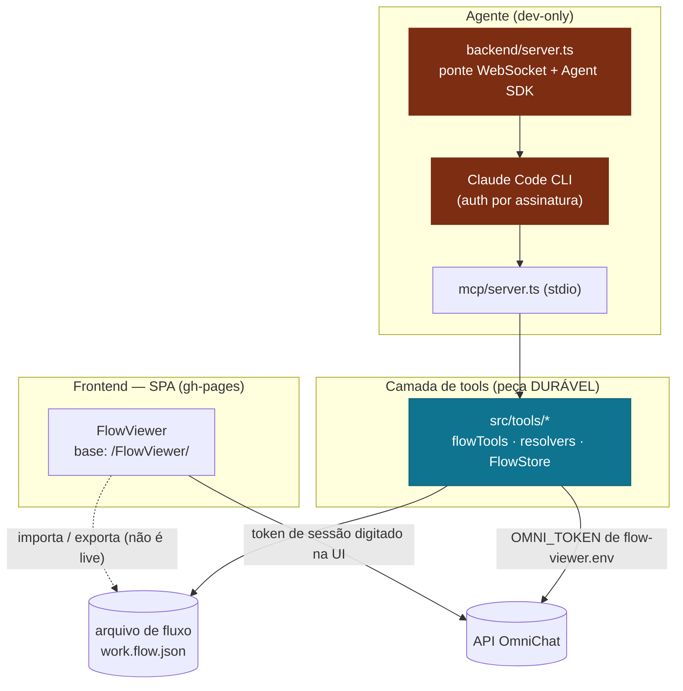

# Guia de migração — integrar o FlowViewer à plataforma OmniChat

Referência para o time que vai **enxertar o FlowViewer na infra da OmniChat**. O objetivo aqui **não** é prescrever *como* migrar (decisão do time) — é entregar **tudo que a ferramenta assume hoje** e **onde ela está acoplada ao ambiente atual** (dev + gh-pages), para que a adaptação seja informada, não arqueológica.

> Leia junto: [README](../README.md) (arquitetura e tipos de nó), [GUIA-DE-USO](GUIA-DE-USO.md) (features ponta a ponta) e [mcp/README](../mcp/README.md) (servidor MCP e as 24 tools).

---

## 1. Panorama: o que é durável e o que é descartável

Hoje há **três peças** que só se cruzam pelo **arquivo de fluxo em disco** e pela **API da OmniChat**:



| Peça | Papel hoje | Na plataforma |
|---|---|---|
| **Camada de tools** (`src/tools/*`, `src/utils/*` de fetch) | Constrói/edita o fluxo e resolve nome→ID contra a API. Validade no código. | **Durável** — reusar como está; trocar só a **fonte do storage** e a **origem do token**. |
| **Servidor MCP** (`mcp/server.ts`) | Expõe as tools por **stdio** ao Claude Code. | **Reusável** — o transporte stdio pode ficar; muda quem é o cliente do MCP. |
| **Ponte + agente** (`backend/server.ts` + Claude Code CLI) | Dirige o Claude Agent SDK autenticado pela assinatura do CLI. | **Descartável** — o CLI é trocado pela **API** (decisão do time; ver §5). |
| **Frontend SPA** | Canvas de edição; lê o fluxo por **import**, não ao vivo. | Migra o hosting (gh-pages → infra OmniChat) e recebe o token **injetado**. |

A regra de ouro do projeto (manter na migração): **o modelo opera tools, nunca escreve JSON cru**; **o token vive na camada de tools/fetch, nunca chega ao modelo nem é logado**; **resolve por nome → grava por ID** (o ID sempre vem de resposta real da API — mata referência alucinada).

---

## 2. Autenticação / token de sessão — o campo que sai

Hoje há **dois caminhos independentes** de token, e **os dois** assumem um **token de sessão Parse** do usuário logado (expira rápido):

### 2.1 Token na UI (frontend)
- Estado React `sessionToken`, iniciado **vazio** e **não persistido** (sem `localStorage`) — [App.tsx:77](../src/App.tsx#L77).
- Digitado no **popover de chave da Sidebar** e propagado como prop `token`/`sessionToken` para **todos** os loaders sob demanda (times, coleções, templates, bots, intenções, listas, APIs, vendedores) e para **push/restore/upload** — [App.tsx:1089-1215](../src/App.tsx#L1089-L1215).
- O gate da caixinha de chat exige `hasFlow × hasToken` — [App.tsx:1048](../src/App.tsx#L1048).

**O que muda:** ao integrar na plataforma, a ferramenta **já recebe o token preenchido** (a plataforma injeta) → **o campo/popover de token da Sidebar sai**. Costura de adaptação:
- Substituir a origem de `sessionToken` (hoje `useState('')` + input) por **injeção da plataforma** (prop, `window.*`, `postMessage`, ou o que a shell da plataforma expuser).
- Remover a UI do token na [Sidebar.tsx](../src/components/Sidebar.tsx) (props `sessionToken`/`onSessionTokenChange`/`tokenOpen`) e a lógica de abertura automática do popover ("Insira o token da sessão").
- O gate `hasToken` passa a ser sempre verdadeiro (ou refletir a validade do token injetado).

### 2.2 Token do agente (MCP)
- Lido por conta própria em [mcp/server.ts:64-73](../mcp/server.ts#L64-L73): `process.env.OMNI_TOKEN` → fallback `flow-viewer.env` (gitignored). **Nunca** chega ao modelo, **nunca** é logado (só logamos "carregado/ausente").
- Injetado nos resolvers ([resolvers.ts:186-189](../src/tools/resolvers.ts#L186-L189)); o `.mcp.json` é **commitado** e por isso **não** carrega o token (só `FLOW_FILE`) — [.mcp.json](../.mcp.json).

**O que muda:** a fonte do token deixa de ser o arquivo `.env` local e passa a ser o que a infra fornecer (secret manager, variável do runtime, credencial de serviço). O ponto de troca é uma função só: `loadOmniToken()`.

### 2.3 Semântica de erro que o código já assume (preservar)
- **401/403** (e **400 + "token"** no endpoint de times) → *"renove o token"*, **sem retry** — [resolvers.ts:48-53](../src/tools/resolvers.ts#L48-L53). É a **falha real nº 1** do modelo atual (sessão Parse expira). Se a plataforma trocar por credencial de vida longa, essa classe de erro muda de natureza — revisar as mensagens-guia.
- Token ausente → *"configure OMNI_TOKEN"*; botId ausente → *"abra/importe um fluxo"*.

> **Decisão em aberto (a ser informada pela Omni):** o modelo de auth em produção **ainda não está definido**. Enquanto for token de sessão, tudo acima vale como está. Se virar API key / service account, reveja: (a) a origem em `loadOmniToken` e na UI, (b) o tratamento de expiração/renovação, (c) os headers (§3.2).

---

## 3. Endpoints, constantes e headers — hoje hardcoded

Tudo que fala com a OmniChat está **fixo no código** (nenhuma variável de ambiente `VITE_*` hoje). Ao migrar, o time provavelmente vai querer **parametrizar por ambiente** (staging × produção × contas diferentes). Inventário completo:

### 3.1 Bases de URL e IDs fixos

> **Já centralizado (PR #13, `d4cb026`):** as constantes abaixo viviam duplicadas em `pushFlow.ts` e `teams.ts` — hoje moram só em [src/config.ts](../src/config.ts), que `teams.ts` importa e reexporta (mantendo os importadores históricos intactos) e que `pushFlow.ts`/`uploadMedia.ts` consomem direto. **O que falta não é mais deduplicar — é parametrizar por ambiente** (`import.meta.env` no front / `process.env` no MCP): hoje `src/config.ts` só tem constantes literais de propósito (o módulo roda também no caminho Node do MCP, sem Vite).

| Constante | Valor | Onde (fonte única) | Observação |
|---|---|---|---|
| API de intents/bots/times/listas/APIs | `https://k0yowczqxg.execute-api.us-east-1.amazonaws.com/prod` | [src/config.ts:23](../src/config.ts#L23) | Consumida via `import { API } from '../config'` em `pushFlow.ts`/`teams.ts`. |
| `APP_ID` (Parse Application Id) | `UCeS99itvZg1tsea2OSoyKvpLbKddhoVAPotIQOy` | [src/config.ts:32](../src/config.ts#L32) | Idem — importada, não mais redeclarada. |
| API de arquivos (upload) | `https://private-api2.omni.chat/files` | [src/config.ts:29](../src/config.ts#L29) | Host **diferente** (API Gateway, não Parse). |
| `PLATFORM_VERSION` | `1.116.16` | [src/config.ts:39](../src/config.ts#L39) | Valor **capturado** da plataforma; o gateway de arquivos dá 401 sem ele. Pode precisar acompanhar a versão real da plataforma. |

> `sessionHeaders(token)` (headers de sessão Parse) também mora em `src/config.ts`, reusada por `teams.ts` e `pushFlow.ts` (era o `buildHeaders` duplicado). Consumidores indiretos — `users.ts`, `endpoints.ts`, `entities.ts` e os resolvers — seguem importando `API`/`APP_ID` de `teams.ts` (reexport), sem mudança de comportamento.

### 3.2 Headers de autenticação (dois perfis distintos)

**API Parse (intents/bots/times/…)** — [pushFlow.ts:183-192](../src/utils/pushFlow.ts#L183-L192):
```
authorization: Bearer <token>
x-parse-session-token: <token>
x-parse-application-id: <APP_ID>
x-omnichat-platform: web
content-type / accept: application/json
```

**API de arquivos (upload)** — [uploadMedia.ts:101-107](../src/utils/uploadMedia.ts#L101-L107): **NÃO** aceita os `x-parse-*` (o preflight CORS bloqueia). Usa `authorization: Bearer`, `x-omnichat-platform: web` e `x-omnichat-platform-version`. O passo 2 (POST ao S3) vai **sem** token — a policy assinada valida.

### 3.3 Contrato da API (rotas usadas)

| Operação | Rota |
|---|---|
| Listar intenções | `GET /v1/{botId}/intents?fullObject=true` |
| Criar/atualizar intenção | `POST /v1/{botId}/intents/{intentId}` |
| Excluir intenção | `DELETE /v1/{botId}/intents/{intentId}` |
| Presigned de upload | `POST /files/v1/presigned-url` → depois POST multipart ao S3 |

Comportamento que o push depende (não regredir): **POST com ID desconhecido CRIA e o servidor gera OUTRO ID** (devolvido no corpo) → daí as **2 passadas com remap** de todas as refs (`next.intent`, `choices`, `error.next`, `fallbackIntents`, `context`) — [pushFlow.ts:107-144, 204-308](../src/utils/pushFlow.ts#L107-L144). O DELETE é de **consistência eventual** (responde 200 mas ainda lista logo depois) → o restore reverifica em laço.

---

## 4. Fonte de verdade do fluxo (FlowStore) — arquivo → storage

A costura de storage **já foi isolada de propósito** (era a Fase 5 do plano-produto):

- As tools só conhecem `flow` / `beginMutation` / `save` / `revert` — [flowStore.ts](../src/tools/flowStore.ts).
- Duas fábricas: `FlowStore.fromFile(path)` (disco, usada hoje) e **`FlowStore.fromObject(model)`** (em memória, **sem persistência** — o ponto de enxerto do storage em nuvem) — [flowStore.ts:41-49](../src/tools/flowStore.ts#L41-L49).
- `save()` é **no-op** em store de memória; em disco grava e mantém um `.bak` de sessão para o `revert`.

**Costura de adaptação:** trocar a origem/destino do fluxo (arquivo → API/DB da plataforma) mexendo **só** na FlowStore (ou numa subclasse), sem tocar nas 24 tools. Onde o caminho do arquivo é resolvido hoje: [mcp/server.ts:40-53](../mcp/server.ts#L40-L53) (`FLOW_FILE` env → arg CLI → `public/masterFlow.json`).

**Importante sobre o frontend:** a SPA **não** lê o fluxo ao vivo — ela importa por colar-JSON/upload sob demanda ([ImportDialog](../src/components/ImportDialog.tsx)). Se a plataforma quiser que o canvas abra já com o fluxo do bot, isso é **integração nova** (buscar o fluxo pela API no load), não algo que exista hoje.

---

## 5. Agente: do Claude Code CLI para a API

Hoje o agente é **dev-only** e amarrado ao CLI ([backend/server.ts](../backend/server.ts)):
- Uma sessão do **Claude Agent SDK** por conexão WebSocket, `resume` entre turnos, `model: 'claude-sonnet-4-6'`, `maxTurns: 40`, `permissionMode: 'bypassPermissions'` — [backend/server.ts:104-122](../backend/server.ts#L104-L122).
- **Auth do modelo** = assinatura do Claude Code CLI (**sem** `ANTHROPIC_API_KEY`).
- Sobe o MCP como **subprocesso stdio** (`npx -y tsx mcp/server.ts`) passando `FLOW_FILE` do arquivo de trabalho descartável (tmpdir) — nunca o `masterFlow.json` canônico.

**O que já foi sinalizado pelo time:** na plataforma **não** haverá CLI; o agente provavelmente usará a **API** (Anthropic Messages API / Agent SDK com API key). Essa decisão fica com o time de plataforma — o que este projeto entrega pronto para reuso:
- **O servidor MCP e as 24 tools** ficam iguais (o MCP é agnóstico de cliente).
- O que é substituído é **`backend/server.ts`**: em vez de `query()` do CLI, o loop de tool-use passa a ser dirigido por API. O MCP pode continuar por stdio (o cliente conecta nele) ou ser embutido.
- Reavaliar na virada: `permissionMode` (o `bypassPermissions` faz sentido no PoC confiável; num serviço multiusuário, não), `maxTurns`, o modelo, e como cada sessão isola seu arquivo/estado de fluxo.

> A ponte WebSocket é encaminhada em dev pelo proxy `/agent-ws` do Vite ([vite.config.ts:13](../vite.config.ts#L13)); em produção o transporte do agente é o que a plataforma definir.

---

## 6. Build e hosting do frontend

- **Base path:** `base: '/FlowViewer/'` em [vite.config.ts:6](../vite.config.ts#L6) — casado com o gh-pages. **Mudar** para o path onde a plataforma servir a SPA (ou `/`).
- **Deploy atual:** `npm run build` → `npm run deploy` (gh-pages, `dist/`). Migra para o pipeline de deploy da plataforma.
- **Proxies só de dev** ([vite.config.ts:7-29](../vite.config.ts#L7-L29)): `/agent-ws` (WebSocket → backend local) e `/s3-proxy` (contorna o CORS do bucket S3 em `localhost`). **Não** existem em produção.
- **Upload em produção:** o [uploadMedia.ts:59-68](../src/utils/uploadMedia.ts#L59-L68) usa a **URL absoluta** do S3 quando **não** é dev. Isso depende de o bucket liberar **CORS para a origem da plataforma** — confirmar, senão o upload direto do browser quebra (é o mesmo motivo do proxy em dev).
- **Sem variáveis de ambiente hoje:** nada de `VITE_*`. Se quiserem staging × produção, é aqui que entra (junto com §3.1).

---

## 7. Modelo de segurança a preservar

Independentemente de como a migração for feita, manter as invariantes que o projeto já garante e testa:
- **Token nunca ao modelo, nunca logado** — vale para o MCP ([mcp/server.ts:64-83](../mcp/server.ts#L64-L83)) e para os fetch/push/upload (mensagens de erro e relatório são **sanitizados**, sem token nem headers).
- **Resolve por nome → grava por ID** — o modelo não inventa IDs de time/usuário/bot/API/lista; o ID vem sempre da API ([resolvers.ts](../src/tools/resolvers.ts)). Ambíguo/parcial → o agente **para e pergunta**.
- **Push escreve só no rascunho**, nunca publica; guardrails (confirmar botId, trava de bot de testes, dry-run, backup antes de escrever) — [GUIA-DE-USO §6](GUIA-DE-USO.md).
- **Nunca commitar segredos** — `flow-viewer.env` é gitignored; `.mcp.json` (commitado) só carrega `FLOW_FILE`.

---

## 8. Decisões em aberto (definir antes do go-live)

| Tema | Estado hoje | A decidir |
|---|---|---|
| **Auth em produção** | Token de sessão Parse (expira rápido), injetado externamente | **Indefinido** — API key / service account / OAuth? Muda §2 inteira. |
| **Origem do token** | UI: campo manual · MCP: `flow-viewer.env` | De onde a plataforma injeta em cada lado. |
| **Storage do fluxo** | Arquivo em disco (`fromFile`) | API/DB da plataforma via `fromObject`/subclasse da FlowStore. |
| **Como o agente roda** | Claude Code CLI (assinatura) | API (decisão do time); rever `permissionMode`/isolamento por sessão. |
| **Hosting + config** | gh-pages, `base:/FlowViewer/`, tudo hardcoded | Path/deploy da plataforma; parametrizar endpoints por ambiente. |
| **CORS do upload** | Proxy em dev; URL absoluta em prod | Confirmar CORS do bucket para a origem da plataforma. |

---

## 9. Referência rápida de arquivos

| Arquivo | Papel | Migração |
|---|---|---|
| [src/tools/flowStore.ts](../src/tools/flowStore.ts) | Fonte de verdade do fluxo (arquivo/memória) | **Tocar** — trocar storage (`fromObject`). |
| [src/tools/flowTools.ts](../src/tools/flowTools.ts) | 15 tools de leitura/mutação | Reusar como está. |
| [src/tools/resolvers.ts](../src/tools/resolvers.ts) | 8 resolvers nome→ID + token | Reusar; token vem de fora. |
| [src/config.ts](../src/config.ts) | Fonte única: `API`/`PARSE`/`FILES_API`/`APP_ID`/`PLATFORM_VERSION` + `sessionHeaders()` | **Tocar** — parametrizar por ambiente (`import.meta.env`/`process.env`) quando a infra da plataforma definir staging×produção; hoje são literais. |
| [src/utils/pushFlow.ts](../src/utils/pushFlow.ts) | Push (2 passadas + remap); importa `API`/`sessionHeaders` de `config.ts` | Reusar como está — endpoints já centralizados. |
| [src/utils/teams.ts](../src/utils/teams.ts) | Fetch de times; importa e **reexporta** `API`/`APP_ID`/`sessionHeaders` de `config.ts` | Reusar como está — sem cópia própria. |
| [src/utils/uploadMedia.ts](../src/utils/uploadMedia.ts) | Upload S3 presigned + `PLATFORM_VERSION` | **Tocar** — CORS/versão/endpoint. |
| [mcp/server.ts](../mcp/server.ts) | Servidor MCP stdio + `loadOmniToken` | **Tocar** — origem do token e do fluxo. |
| [backend/server.ts](../backend/server.ts) | Ponte WS + Agent SDK (CLI) | **Substituir** — API no lugar do CLI. |
| [src/App.tsx](../src/App.tsx) | Estado `sessionToken` + loaders | **Tocar** — token injetado, remover campo. |
| [src/components/Sidebar.tsx](../src/components/Sidebar.tsx) | UI do token (popover de chave) | **Remover** a parte do token. |
| [vite.config.ts](../vite.config.ts) | `base`, proxies de dev | **Tocar** — base path e config por ambiente. |
| [.mcp.json](../.mcp.json) | Registro do MCP no Claude Code | Contexto CLI; adaptar ao cliente da plataforma. |
