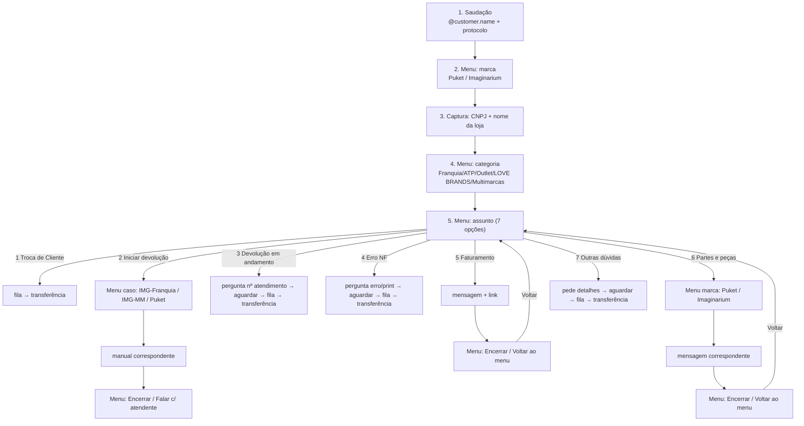

# Prompt de construção — fluxo "Grupo Uni.co (lojista)"

> Prompt multi-turno para a caixinha de chat (agente construtor + MCP tools) montar o fluxo
> documentado no PDF "Reestruturação Omnichat Lojista" **o mais fiel possível**. Fechado por
> interrogatório (skill `interrogar`) em 2026-06-26.

## Objetivo (1 frase)

Construir, pela caixinha, o fluxo de atendimento ao lojista do Grupo Uni.co o mais fiel
possível ao PDF, dentro do que as tools MCP atuais permitem — com as partes sem tool
adaptadas e documentadas, não fingidas.

## Decisões de design (com o porquê)

| Tema | Decisão | Porquê |
|---|---|---|
| Cobertura | Todo o PDF possível | Objetivo é fidelidade ao documentado, não amostra mínima |
| Topologia | Tronco linear + bifurcação local só nos ramos 2 e 6 | Não há condição por variável nas tools; bifurcar no topo (marca×categoria) duplicaria quase tudo. O menu local honra a regra do manual sem explodir o grafo |
| Dinâmicos | `@customer.name`, `@chat.customerSupportRequestId` | Variáveis reais do catálogo ([variables.ts](../src/utils/variables.ts)); interpoladas em runtime. Não há "primeiro nome" isolado — `@customer.name` é a aproximação |
| Manuais (anexos) | Balão de texto descritivo + links reais do PDF | `set_message` só grava TEXT; mídia/anexo exige URL S3 que o agente não pode sintetizar |
| Saudação de fila | defaultNode antes de cada transferência | Consideração geral do PDF ("Para os ATs que entrarem... encaminhar a saudação") |
| Voltar/Fim | Opções de menu (Encerrar/Voltar) onde o PDF lista | Não há palavra-chave global nas tools; o menu é a aproximação fiel |
| Fora-de-horário | 2 nós de mensagem soltos (sem gate de tempo) | **Gap de tool:** não há como criar 2ª condição + critério `@bot.isOpenNow` + "Senão". Fica como rascunho até existirem tools de condição |
| Transferências | Agente resolve o time por nome (find_team/list_teams) | Regra-âncora: nunca inventar ID; se ambíguo/ausente, perguntar |

## Limites de tool conhecidos (NÃO são falha do prompt)

- **Sem condição por variável:** roteamento só por escolha do usuário (`choiceNode`). Por isso
  a bifurcação local nos ramos 2 e 6 (em vez de condição por marca/categoria escolhida antes).
- **`setDataNode.bulkUpdate` não exposto** → não dá pra gravar variável custom.
- **Intenção dentro/fora-de-horário com "Senão" não é construível** → aproximação por 2 nós soltos.
- **Mídia/anexo** (`IMAGE/FILE`) fora do `set_message` → manuais viram texto + link.

---

## Mapa do fluxo



---

## Os prompts (colar na caixinha, um turno por vez)

### Turno 1 — tronco linear (1→5) + ramos que terminam em transferência (opções 1, 3, 4, 7)

```
Vamos montar o fluxo de atendimento ao lojista do Grupo Uni.co. Comece do zero, encadeando
em sequência:

1. Mensagem de boas-vindas: "Olá @customer.name, seu número de protocolo é
   @chat.customerSupportRequestId. Seja bem-vindo ao Atendimento Grupo Uni.co! Este canal é
   exclusivo para o atendimento ao lojista. Caso seja cliente final, pedimos que entre em
   contato diretamente na central de atendimento em nosso site oficial. Agradecemos seu
   contato."
2. Menu "De qual marca você faz parte?" com as opções: Puket e Imaginarium.
3. Captura "Qual é o seu CNPJ e nome da loja?".
4. Menu "Qual a categoria da loja?" com as opções: Franquia, ATP, Outlet, LOVE BRANDS e
   Multimarcas.
5. Menu "E sobre o que você quer falar?" com as 7 opções: 1) Dúvida Troca de Cliente,
   2) Como iniciar devolução, 3) Dúvidas sobre devolução em andamento, 4) Erro na emissão
   da NF Devolução, 5) Solicitação de faturamento para troca de cliente final, 6) Partes e
   peças (reposição de acessórios), 7) Outras dúvidas.

Conecte 1→2→3→4→5.

Agora ligue, a partir do menu de assunto, os direcionamentos que terminam com a conversa indo
para um atendente humano. Antes de TODA transferência, insira uma mensagem com este texto de
fila: "Sua solicitação foi recebida pela equipe e está na fila de atendimento. Nosso tempo
estimado de retorno é de até 2 horas, mas faremos o possível para falar com você antes disso!
Você pode encerrar o atendimento a qualquer momento, digitando Fim." Em seguida, a
transferência deve ir para o time de atendentes (resolva o time pelo nome com as ferramentas;
se houver mais de um ou nenhum, me pergunte antes de gravar — não invente o ID).

- Opção 1 (Dúvida Troca de Cliente): vai direto para a mensagem de fila e depois a transferência.
- Opção 3 (Dúvidas sobre devolução em andamento): mensagem "Qual é o número de atendimento
  que você quer falar?" → aguardar a resposta do lojista → mensagem de fila → transferência.
- Opção 4 (Erro na emissão da NF Devolução): mensagem "Qual erro de emissão consta no portal?
  Gentileza encaminhar o print da tela." → aguardar a resposta → mensagem de fila → transferência.
- Opção 7 (Outras dúvidas): mensagem "Para que possamos analisar o caso e oferecer o melhor
  direcionamento, explique aqui o seu motivo de contato com o máximo de detalhes possível
  (como prints, dados ou exemplos), isso ajudará a nossa equipe a te dar a melhor resposta.
  Ficamos no aguardo!" → aguardar a resposta → mensagem de fila → transferência.

Deixe as opções 2, 5 e 6 do menu de assunto sem destino por enquanto — ligamos nos próximos
passos.
```

### Turno 2 — opções 2, 5 e 6 (bifurcações locais + faturamento)

```
Agora as opções restantes do menu de assunto criado no passo anterior: 2 (Como iniciar
devolução), 5 (Solicitação de faturamento para troca de cliente final) e 6 (Partes e peças).

Opção 5 (faturamento): envie esta mensagem: "Olá, @customer.name! ✨ Se você é uma franquia ou
Outlet Puket, podemos verificar a disponibilidade de estoque e possibilidade de faturamento do
item para a troca do seu cliente final. A solicitação deve ser feita através do Portal de
Serviços, em nossa Central de relacionamento. Gentileza acessar o link:
https://grupounico.neoassist.com/?th=tag_vlojistapuketfixa . Clicar sobre o ícone de e-mail,
selecionar no assunto FATURAMENTO DE PRODUTO e preencher o formulário. Um grande abraço!"
Depois da mensagem, ofereça um menu com duas opções: "Encerrar" e "Voltar ao menu". "Encerrar"
encerra a conversa. "Voltar ao menu" volta para o menu de assunto ("E sobre o que você quer
falar?").

Opção 2 (devolução): como o manual muda conforme a marca e a categoria, crie um menu "Para te
enviar o manual certo, qual é o seu caso?" com três opções, cada uma levando a uma mensagem:
- "Imaginarium - Franquia": mensagem "Segue o manual de devolução da Imaginarium. (anexar aqui
  o documento: Manual de devolução - Imaginarium)".
- "Imaginarium - Multimarcas": mensagem "No momento o manual de devolução para Multimarcas
  Imaginarium está em atualização. Vou te encaminhar para um atendente para seguir com seu
  caso."
- "Puket - Franquia ou Multimarcas": mensagem "Segue o manual de devoluções da Puket. (anexar
  aqui o documento: Manual de devoluções - Puket)".
Depois de cada mensagem, ofereça um menu com "Encerrar" e "Falar com atendente". "Encerrar"
encerra a conversa. "Falar com atendente" leva à mensagem de fila (mesmo texto usado acima
para as transferências) e depois à transferência para o time de atendentes.

Opção 6 (partes e peças): a mensagem muda conforme a marca, então crie um menu "De qual
marca?" com "Puket" e "Imaginarium", cada uma levando a uma mensagem:
- Puket: "Olá, @customer.name! ✨ Para verificarmos se temos a peça desejada em estoque para
  reposição, será necessário abrir um atendimento através de nosso Portal de Serviços, em nossa
  Central de Relacionamento. Gentileza acessar o link:
  https://grupounico.neoassist.com/?th=tag_vlojistapuketfixa . Clicar sobre o ícone de e-mail
  e preencher o formulário com assunto: PARTES E PEÇAS. Segue também o manual com o passo a
  passo (anexar aqui: Manual atendimento Partes e Peças - Puket). Continuamos à disposição para
  qualquer dúvida que a loja possa ter! Um grande abraço!"
- Imaginarium: "Olá, @customer.name! ✨ Para verificarmos se temos a peça desejada em estoque
  para reposição, será necessário abrir um atendimento de dúvida, no portal de devoluções em:
  NOVO ATENDIMENTO >> SOLICITAÇÃO DE PARTES E PEÇAS. Continuamos à disposição para qualquer
  dúvida que a loja possa ter!"
Depois de cada mensagem, ofereça um menu com "Encerrar" e "Voltar ao menu". "Encerrar" encerra
a conversa. "Voltar ao menu" volta para o menu de assunto criado no turno 1.
```

### Turno 3 — mensagens de fora de horário (2 nós soltos)

```
Por fim, crie duas mensagens SOLTAS (sem conectar ao fluxo) só para deixar o conteúdo pronto
no canvas:

1. "Olá @customer.name, é um prazer receber o seu contato. Seja muito bem-vindo ao Grupo
   Uni.co! Queremos muito te ouvir e auxiliar com sua demanda. Nosso horário de atendimento é
   de Segunda a Sexta das 10:00 às 11:30 e das 13:30 às 17:30 (exceto feriados). Pedimos a
   gentileza de nos acionar novamente dentro desse horário. Aguardamos o seu contato para
   conversarmos!"
2. "Olá, @customer.name! Recebemos a sua nova mensagem. No momento, nossa equipe está fora do
   horário de expediente. Assim que retornarmos, daremos sequência ao seu atendimento. Um
   abraço e até logo!"
```

---

## Critério de sucesso

- Tronco 1→5 encadeado, com os textos e variáveis corretos; menus de marca/categoria/assunto
  com os itens certos (7 e 5 → LIST; 2 → BUTTON).
- Os 7 direcionamentos ligados às opções certas do menu de assunto.
- Bifurcação local nos ramos 2 e 6 via menu; ramos 1/3/4/7 terminam em fila → transferência.
- "Voltar ao menu" **reconecta** ao menu de assunto (ciclo), não cria menu novo.
- Transferências com time resolvido por nome — **sem ID inventado**; agente pergunta se ambíguo.
- 2 nós de fora-de-horário criados e desconectados.
- `validate` sem erros estruturais; canvas re-renderiza sem branquear.

## Pendências / não cobertos (assumidos)

- **Gate de horário real** (intenção dentro/fora com "Senão"): bloqueado por falta de tools de
  condição. Os 2 textos ficam como nós soltos; configurar o disparo por tempo na plataforma.
- **Manuais como anexo de verdade:** ficam como texto "(anexar aqui …)"; subir o arquivo na Omni.
- **Voltar/Fim como palavra-chave global:** aproximado por opções de menu onde o PDF lista.
- **Campos obrigatórios (2–5):** já naturais (choice/capture travam o avanço) — sem flag extra.
